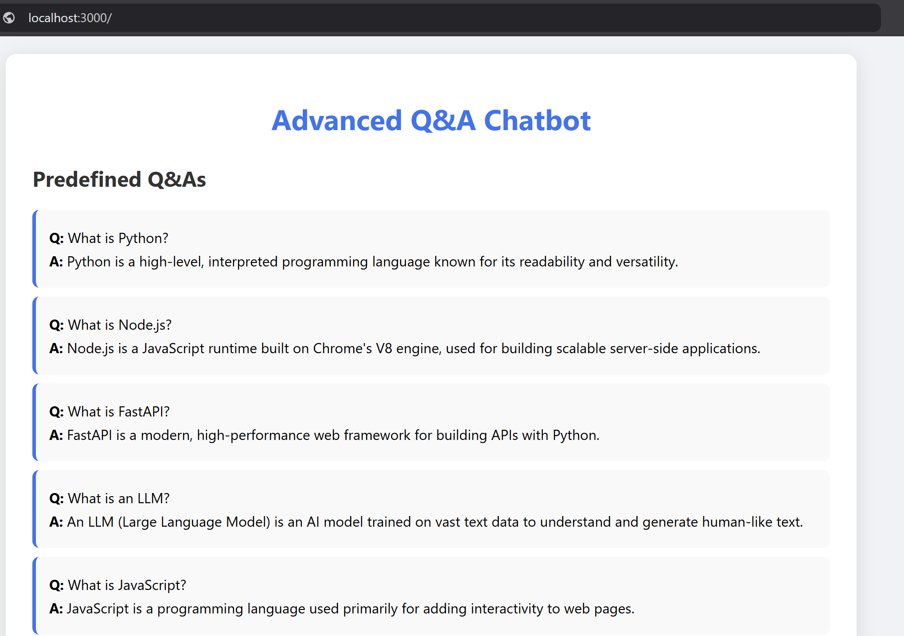
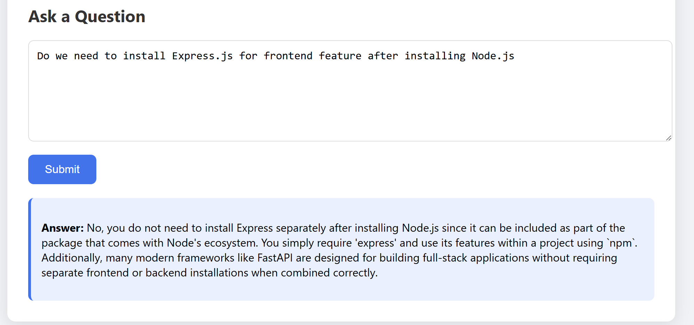

# Advanced Q&A Chatbot

A modern web application with a Node.js frontend and FastAPI backend, featuring 10 predefined Q&As and a chatbot powered by a local LLM (Phi-3 via Ollama). Users can view Q&As and submit questions to get answers from the predefined dataset or AI-generated responses.

   ```bash
   advanced-qna-chatbot/
   ├── backend/
   │   ├── main.py
   │   └── requirements.txt
   ├── frontend/
   │   ├── public/
   │   │   ├── styles.css
   │   │   └── script.js
   │   ├── views/
   │   │   └── index.ejs
   │   ├── package.json
   │   ├── server.js
   │   └── node_modules/ (created after npm install)
   ├── README.md
   └── .gitignore
   ```
## Features
- Dynamic Node.js frontend using Express and EJS for a modern UI.
- FastAPI backend with CORS support for API communication.
- 10 predefined Q&A pairs covering programming and tech topics.
- Local LLM (Phi-3) for privacy-focused, cost-free AI responses.
- Enhanced styling with a clean, responsive design.

## Prerequisites
- Python 3.8+
- Node.js 18+ and npm
- Ollama installed (https://ollama.com/)
- Git

## Setup
1. Clone the repository:
   ```bash
   git clone https://github.com/pjlau/nodejs-qna-chatbot.git
   cd nodejs-qna-chatbot
2. Install the required libraries:
   ```bash
   cd backend
   pip install -r requirements.txt
3. Ensure the Ollama is installed:
   ```bash
   ollama --version
4. Pull a free LLM model (e.g. `phi3` for efficiency):
   ```bash
   ollama pull phi3
5. Serve the LLM model (e.g. `phi3` for efficiency):
   ```bash
   ollama serve
6. Install the frontend dependency and start the frontend
   ```bash
   cd ..
   cd frontend
   npm install
   npm start
7. Start the FastAPI backend
   ```bash
   cd ..
   cd backend
   python main.py
8. Open your browser and navigate to `http://localhost:3000`.


## Results

<br>

